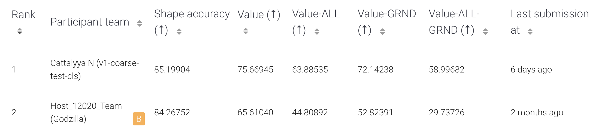

<div align="center">
<p align="center">
     
</p> 
<h1 align="center">
</h1>
<h1 align="center">
    3DCoMPaT++: The Winning Solution 🏆 for 3D Compositional Part and Material Segmentation challenge.
</h1>

[](https://colab.research.google.com/drive/1OpgYL_cxekAqZF8B8zuQZkPQxUIxzV0K?usp=sharing)
[](https://3dcompat-dataset.org/doc/)
[](https://3dcompat-dataset.org/doc/dl-dataset.html)
[](https://3dcompat-dataset.org/)
[](https://3dcompat-dataset.org/workshop/)
[](https://eval.ai/web/challenges/challenge-page/2031)

</div>

## Summary

- [Introduction](#-introduction)
- [Getting started](#-getting-started)
- [Model Performance](#-model-performance)
- [Acknowledgments](#-acknowledgments)
- [Citation](#citation)

<br>


<br>

## 📚 Introduction

This repo contains the winning model 🏆 of both coarse and fine-grained tracks for [3DCoMPaT Grounded CoMPaT Recognition Challenge](https://eval.ai/web/challenges/challenge-page/2031/overview) organized by [C3DV CVPR 2023 workshop](https://3dcompat-dataset.org/workshop/). Built on top of the original [3DCoMPaT-v2 challenge codebase](https://github.com/Vision-CAIR/3DCoMPaT-v2), the model uses PointNet++ as a backbone and expands training to 6D (rgb). This 3D point clouds segmentation model achieves accuracy of material segmentation 98% (from 46%) and part segmentation 97% (from 85%). This work also explores multimodal 2D/ 3D training PointNet++ with 2D segmentation logits from the given [pretrained SegFormer](./models/2D/segmentation/) as well as top-3 2D segmentation label which is more effective in increasing accuracy (1-2%).

**We plan to further extend the work: stay tuned!** 🔥

<br>

## 🚀 Getting started

### Train the model
- To train the part segmentation model, run `python train_partseg.py --data_name=coarse --batch_size=128`.
- To train the mat segmentation model, run `python train_matseg.py --data_name=coarse --batch_size=128`.
- **The pre-trained model will be uploaded soon: stay tuned!** 

### Inference
- To run inference of shape classification, part and material segmentation together, `python predict.py  --data_type=coarse --n_comp=10 --batch_size=160 --split=test`.

<br>

## 📊 Model Performance

- Model performance comparison on shape-aware part and material segmentation. The first three rows (partseg) is measured by organizers as [reported here](https://github.com/Vision-CAIR/3DCoMPaT-v2/tree/main/models/3D).

### Performance on validation dataset
#### **Coarse-grained**

| Model                 | PartSeg Accuracy | PartSeg mIOU | MatSeg Accuracy | MatSeg mIOU | ckpt                                                                                            |
| --------------------- | ---------------- | -------- | ---------------- | ------------------- | ----------------------------------------------------------------------------------------------- |
| PointNet2             |  84.72    | 77.98            | 46.62             | 38.59              | [gdrive](https://drive.google.com/file/d/1HrwGvEr3RUq2KNKZCdPhho1y-krTmwwt/view?usp=share_link) |
| Curvenet              |  86.01    | 80.64            | N/A              | N/A               | [gdrive](https://drive.google.com/file/d/1Q6yhwFemwIVcy1RivSIXJ0z_8Fz986I0/view?usp=share_link) |
| PointNeXt             |  94.17    | 86.80            | N/A             | N/A              | [gdrive](https://drive.google.com/file/d/174EHOftBhupCRI3p-vRjQayB4Z_Z1rGG/view?usp=share_link) |
| PointNet2 6D (ours)   |  **97.05**| **87.74**        | **98.65**           | **96.24**         | TODO |

#### **Fine-grained**

| Model                 | PartSeg Accuracy | PartSeg mIOU | MatSeg Accuracy | MatSeg mIOU |ckpt                                                                                            |
| --------------------- | ---------------- | -------- | ---------------- | ------------------- | ----------------------------------------------------------------------------------------------- |
| PointNet2             | 71.09         | 80.01          | TODO               | TODO               | [gdrive](https://drive.google.com/file/d/1_dPGJU1n4Q4pzm6ZxSw0W5zYKlP5mOcL/view?usp=share_link) |
| Curvenet              | 72.49         | 81.37          | N/A              | N/A               | [gdrive](https://drive.google.com/file/d/1rmGNvb2uXPLqSDtOU7wGiz9Q_4nozd1D/view?usp=share_link) |
| PointNeXt             | 82.07         | **83.92**      | N/A              | N/A               | [gdrive](https://drive.google.com/file/d/1ABNbcde2gMu0IU6Eub3BXkNr2HHvHFqN/view?usp=share_link) |
| PointNet2 6D (ours)   | **86.33**     | 77.62          | **98.86**           | **94.42**         | TODO |

<br>

### **Challenge metrics compared with the baseline**



## 🙏 Acknowledgments

⚙️ Thank you Habib Slim, Professor Mohamed Elhoseiny, and the challenge organizer for making the great challenge and very useful codebase for us to experiment on top very easily.

</br>

## Citation

If you use their 3DCoMPaT++ dataset, please cite the two following references:

```bibtex
@article{slim2023_3dcompatplus,
    title={3DCoMPaT++: An improved Large-scale 3D Vision Dataset
    for Compositional Recognition},
    author={Habib Slim, Xiang Li, Yuchen Li,
    Mahmoud Ahmed, Mohamed Ayman, Ujjwal Upadhyay
    Ahmed Abdelreheem, Arpit Prajapati,
    Suhail Pothigara, Peter Wonka, Mohamed Elhoseiny},
    year={2023}
}
```

```bibtex
@article{li2022_3dcompat,
    title={3D CoMPaT: Composition of Materials on Parts of 3D Things},
    author={Yuchen Li, Ujjwal Upadhyay, Habib Slim,
    Ahmed Abdelreheem, Arpit Prajapati,
    Suhail Pothigara, Peter Wonka, Mohamed Elhoseiny},
    journal = {ECCV},
    year={2022}
}
```

</br>

This repository is owned and maintained by <a href="https://www.cattalyya.com/">Cattalyya Nuengsigkapian</a>.

## References

1. _[Li et al., 2022]_ - 3DCoMPaT: Composition of Materials on Parts of 3D Things.
2. _[Xie et al., 2021]_ - SegFormer: Simple and Efficient Design for Semantic Segmentation with Transformers.
3. _[He et al., 2015]_ - Deep Residual Learning for Image Recognition.
